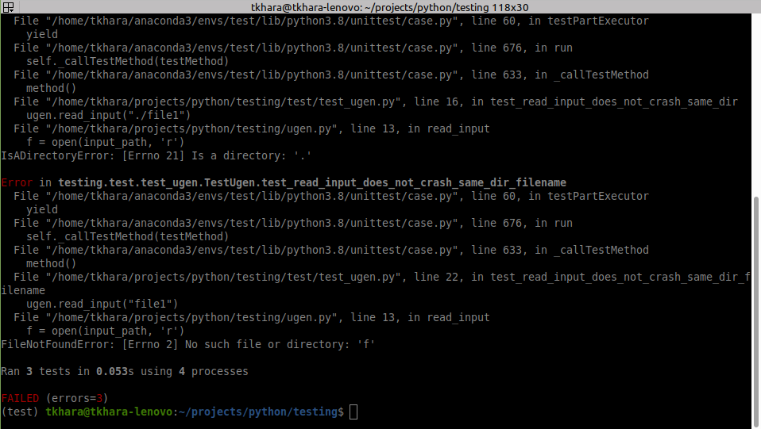

# test_proj

To run the tests just download the repo and use pip to install the testing dependences in the requirements.txt

Then the run command is 

    green -vvv

You will see output like this:

